<h1 align="center">CareerHive</h1>

<p align="center"><b>Grow on purpose.</b><br>A career-growth platform where employees learn, prove their progress and ask for their next role, and where HR and managers decide in one clear flow.</p>

<p align="center">
  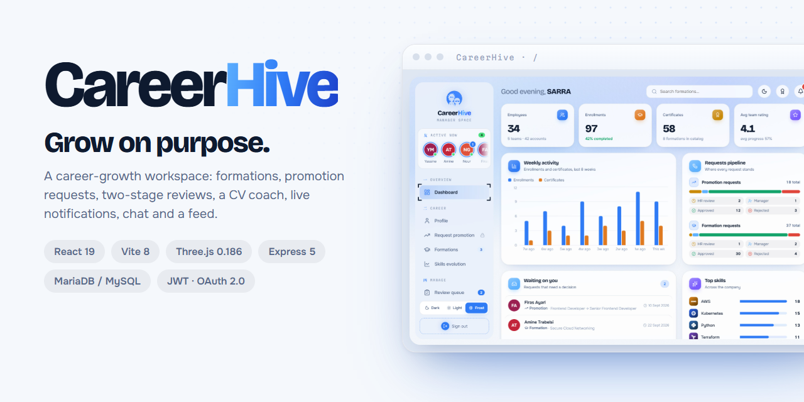
</p>

<p align="center">
  <a href="https://career-hive-ebon.vercel.app"><b>Live app</b></a> &nbsp;·&nbsp;
  <a href="presentation/pdf/CareerHive-Project-Book.pdf"><b>Project book</b></a> &nbsp;·&nbsp;
  <a href="#product-film"><b>Product film</b></a> &nbsp;·&nbsp;
  <a href="#architecture"><b>Architecture</b></a> &nbsp;·&nbsp;
  <a href="#getting-started"><b>Run it locally</b></a>
</p>

<p align="center">
  
  
  
  
  
  
</p>

<p align="center"><sub>9 features · 13 screens · 70 API routes · 23 tables · 35 end-to-end tests · 3 themes<br>Status: live on free tiers: the UI on Vercel, the API on Render, MySQL 8.4 on Aiven.</sub></p>

<p align="center"><b><a href="https://career-hive-ebon.vercel.app">▶ Open CareerHive</a></b><br><sub>Create an account with your email and confirm it from the link you receive. After 15 idle minutes the free server sleeps, so the first request can take up to a minute.</sub></p>

---

## What is CareerHive?

CareerHive is a full-stack web platform for growing inside a company. Employees follow formations (trainings), collect
certificates and request promotions; HR reviews each request first and the manager makes the final call. Everything that
happens is pushed live to the people concerned, and the whole team can talk, post and follow each other in one place.

**The problem.** Growth usually lives in separate tools: training in spreadsheets, requests in email threads, feedback in
side chats. Employees can't see what unlocks their next role, and approvals are a black box.

**The solution.** One path, *Learn → Prove → Grow*, with real rules behind it: a promotion request only opens once the
work is done (3 completed formations, 1 certificate, 50 % average progress), every decision has a stage and an owner,
and every step notifies the person it affects.

## Product preview

<p align="center">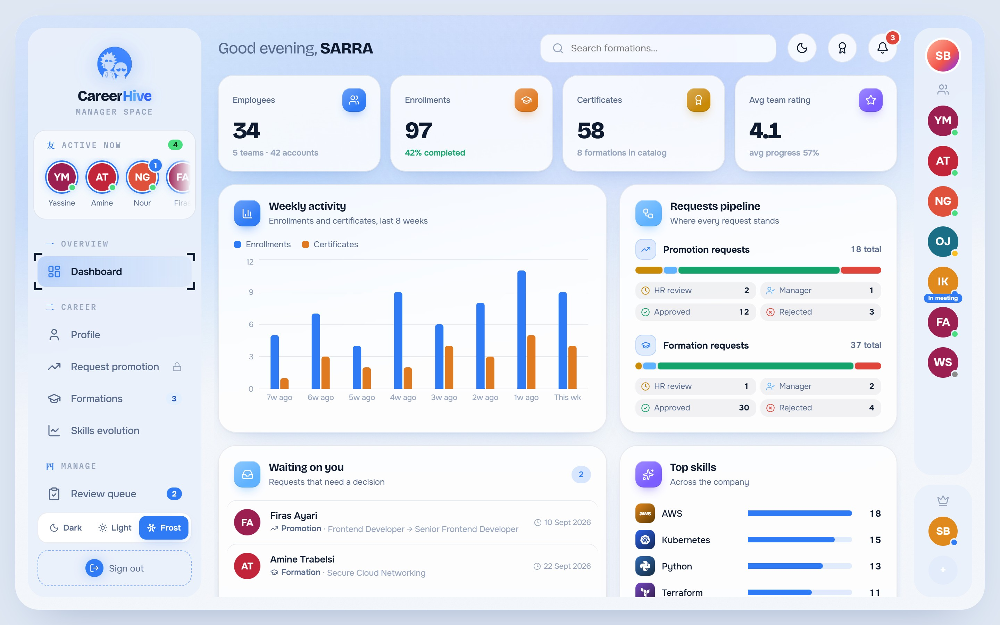</p>
<p align="center"><sub>The organisation dashboard for HR and managers: KPIs, weekly activity, request pipelines and top skills.</sub></p>

<table>
  <tr>
    <td width="33%">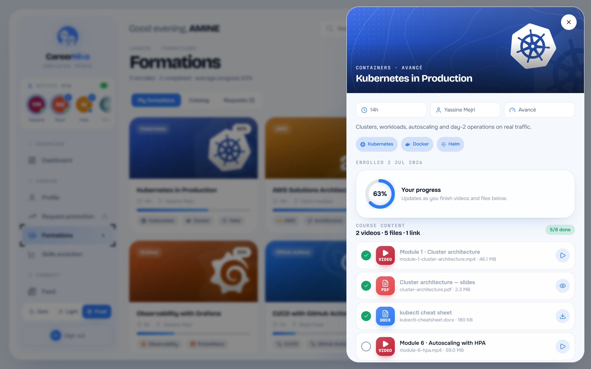<br><sub><b>Course content</b> · videos, files and links; progress follows what you finish</sub></td>
    <td width="33%">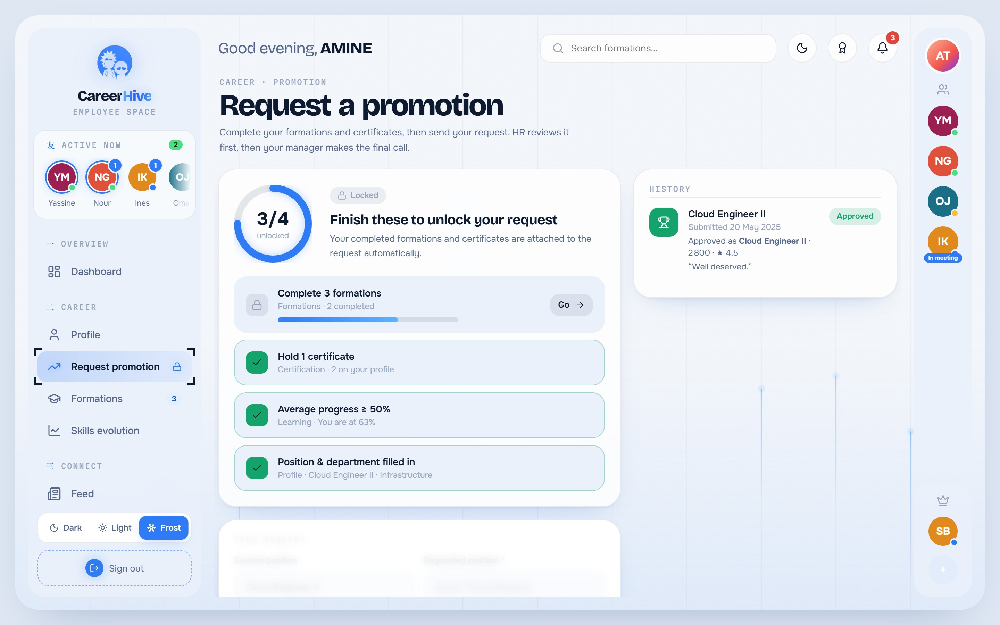<br><sub><b>Request a promotion</b> · unlocked by real requirements</sub></td>
    <td width="33%">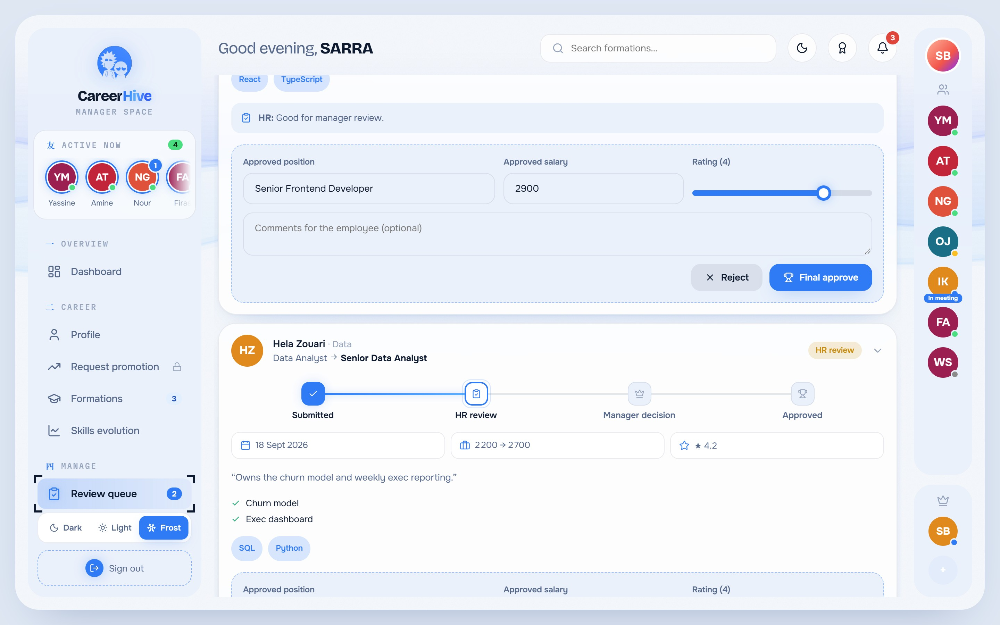<br><sub><b>Review queue</b> · HR forwards, the manager decides</sub></td>
  </tr>
  <tr>
    <td width="33%">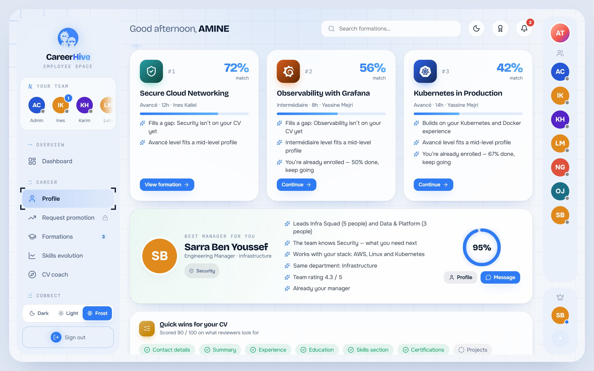<br><sub><b>CV coach</b> · best formations and the manager who fits</sub></td>
    <td width="33%">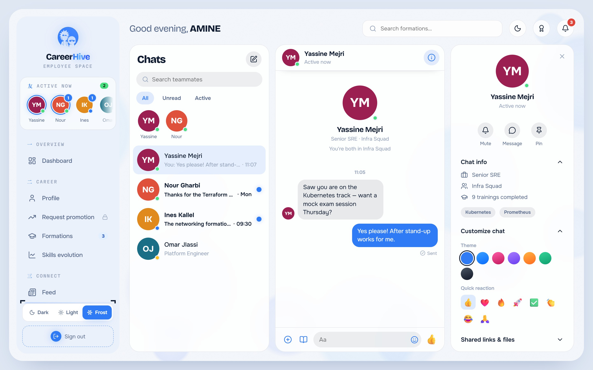<br><sub><b>Team comm hub</b> · Messenger-style chat between accounts</sub></td>
    <td width="33%">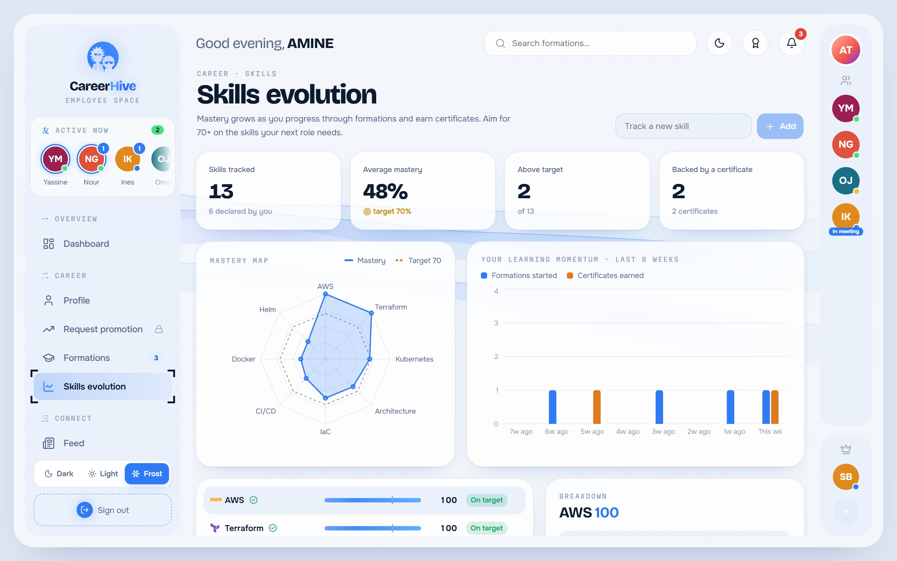<br><sub><b>Skills evolution</b> · mastery radar and weekly momentum</sub></td>
  </tr>
</table>

## Features

| | Feature | What it does |
|---|---|---|
| 1 | **Promotion requests** | Gated by real rules; HR reviews, then the manager approves, which writes the new position and salary to the profile |
| 2 | **Formations & course content** | Catalog with covers generated from real tech logos; join by request or assignment; videos, files and links; progress = finished items ÷ all items |
| 3 | **Review queue** | Promotions and formation requests, each at its stage, with comments; nobody can review their own request |
| 4 | **CV coach** | Upload a PDF, Word or text CV: skills, years of experience, seniority and career track are found, formations are ranked by the gaps they fill and the best manager to learn from is suggested, with tips to improve the CV |
| 5 | **Skills & analytics** | Mastery radar and weekly activity per person; organisation KPIs, request pipelines and top skills for staff |
| 6 | **Team comm hub** | Messenger-style chat between accounts, with presence and floating chat windows |
| 7 | **Live notifications** | Pushed over Server-Sent Events, with a polling fallback; pop-ups, sound and desktop alerts |
| 8 | **Feed & profiles** | Posts with an image, likes, comments, follows and public profiles |
| 9 | **Accounts & roles** | Email confirmation, password reset, Google / LinkedIn / GitHub sign-in; the owner sets who is HR or a manager |

The interface ships with three themes (Frost, Ember for dark mode, Light), 3D scenes built with react-three-fiber, a custom cursor,
animated section backgrounds that respect *reduced motion*, and a **demo mode**: without a backend, the UI runs on an
in-browser mock of every route.

<table>
  <tr>
    <td width="50%">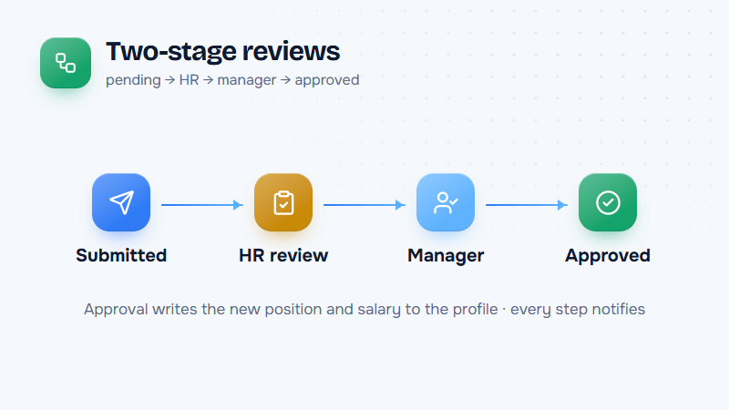</td>
    <td width="50%">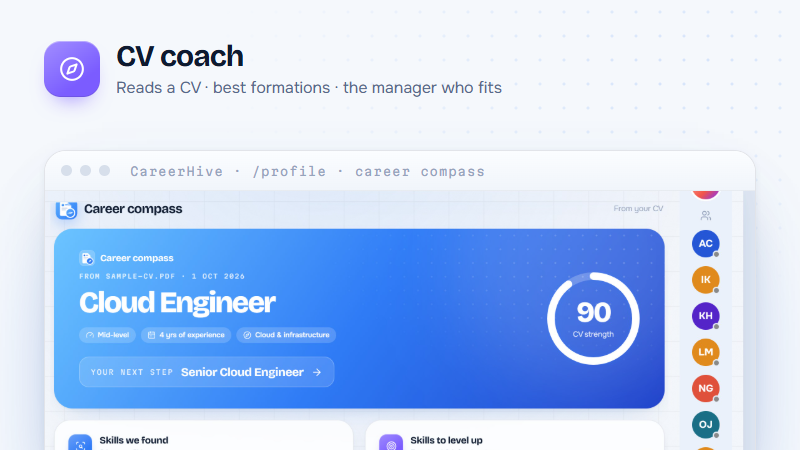</td>
  </tr>
  <tr>
    <td width="50%">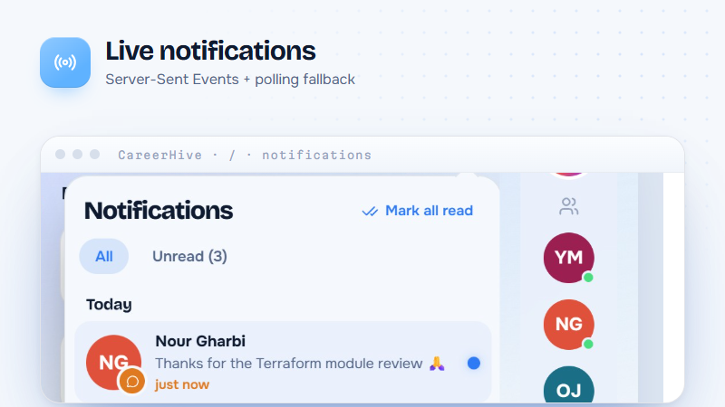</td>
    <td width="50%">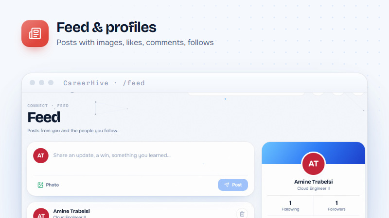</td>
  </tr>
</table>

<details>
<summary><b>How the CV coach works</b></summary>

<br>

- The file is read on the server in memory (PDF with `unpdf`, Word with `mammoth`) and never written to disk; only the
  results are kept, one analysis per person (`cv_analyses`).
- Rules, not an AI service: a skills vocabulary, CV sections, date ranges and job titles give the skills, experience,
  seniority and career track (`careerhive-backend/src/cv/analyze.js`).
- Formations are scored on the gaps they fill and the skills they build; managers on what their teams know, shared
  skills, department and rating. Every match comes with its reasons.

</details>

## Architecture

<p align="center">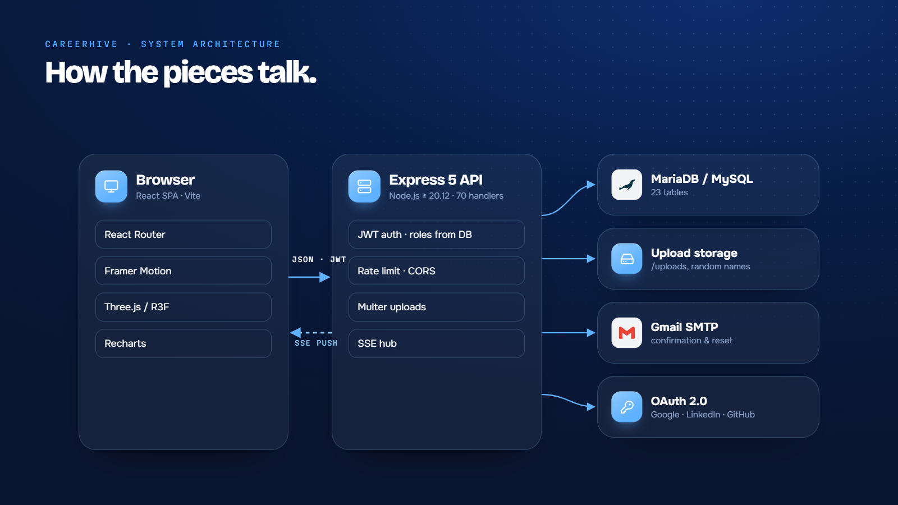</p>

```text
Browser · React 19 SPA (Vite)
   │  HTTPS · JSON · Bearer JWT                  ▲ Server-Sent Events (live notifications)
   ▼                                             │
Express 5 API on Node.js ────────────────────────┘
   ├── MariaDB 10.4 / MySQL 8 · 23 tables (mysql2, parameterised queries, UTC)
   ├── Upload storage · local disk, served at /uploads
   ├── SMTP · Nodemailer (confirmation and reset links)
   └── OAuth 2.0 · Google, LinkedIn, GitHub
```

The UI keeps its state in a React context with a reducer and refreshes the affected parts when the server pushes an
event. The role is read from the database on every request, so a role change applies immediately.

## Tech stack

| Layer | Technologies |
|---|---|
| **Frontend** | React 19 · Vite 8 · React Router 7 · Framer Motion 13 · Recharts 3 · Lucide · Simple Icons |
| **3D** | Three.js r186 · React Three Fiber 9 · drei 10 |
| **Backend** | Node.js 20.12+ (ES modules) · Express 5 · jsonwebtoken 9 · bcryptjs 3 · express-rate-limit 8 · Multer 2 · Nodemailer 10 · unpdf · mammoth |
| **Database** | MariaDB 10.4 / MySQL 8 · mysql2 3 |
| **Quality & tools** | node:test (35 end-to-end API tests) · Playwright (screenshots and UI checks) · Oxlint |

## Design system

<p align="center">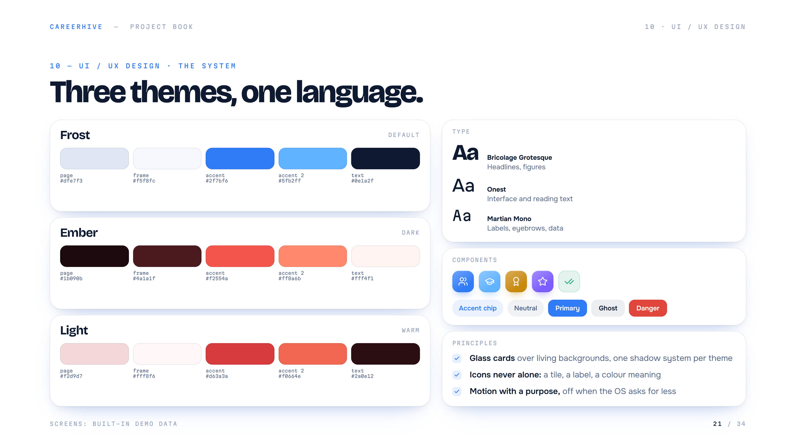</p>

- **Type:** Bricolage Grotesque for headlines and figures, Onest for interface text, Martian Mono for labels and data.
- **Colour:** every theme is a set of tokens (surfaces, accents, shadows, chart colours), so switching theme never changes the layout.
- **Components:** glass cards with one shadow system per theme, icon tiles that always carry a label, chips and buttons with clear states.
- **Motion:** animation explains a change of state. The logo renders on demand, the CV compass animates only while on screen, and the section backgrounds pause in hidden tabs and stop when the system asks for reduced motion.

<details>
<summary><b>Responsive: desktop, tablet and phone</b></summary>

<br>

<table>
  <tr>
    <td width="52%">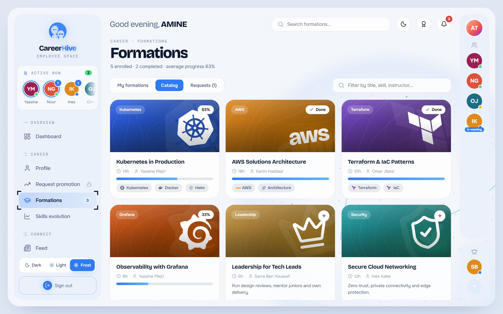<br><sub>Desktop</sub></td>
    <td width="28%">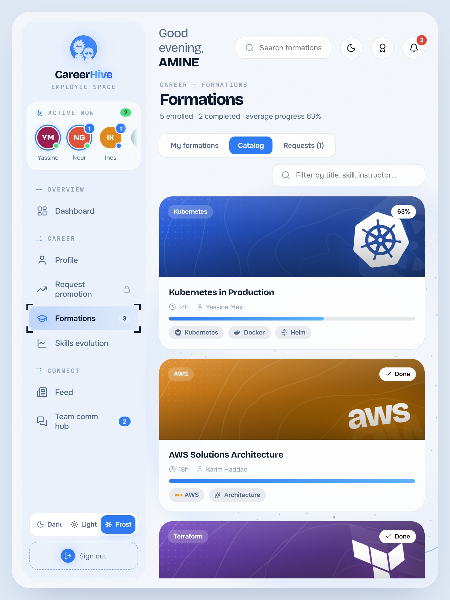<br><sub>Tablet</sub></td>
    <td width="20%">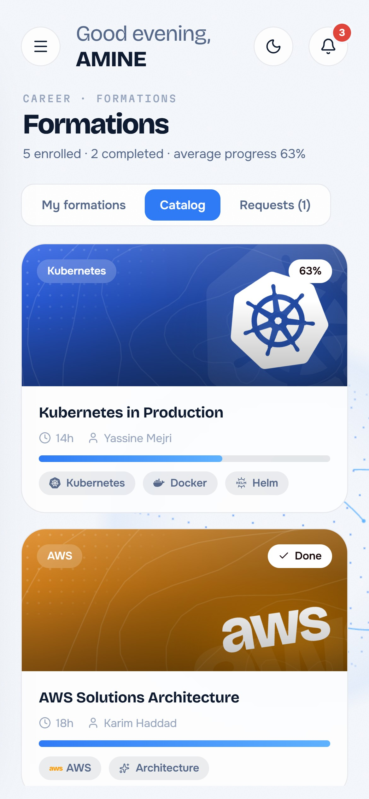<br><sub>Phone</sub></td>
  </tr>
</table>

</details>

## User journey

<p align="center">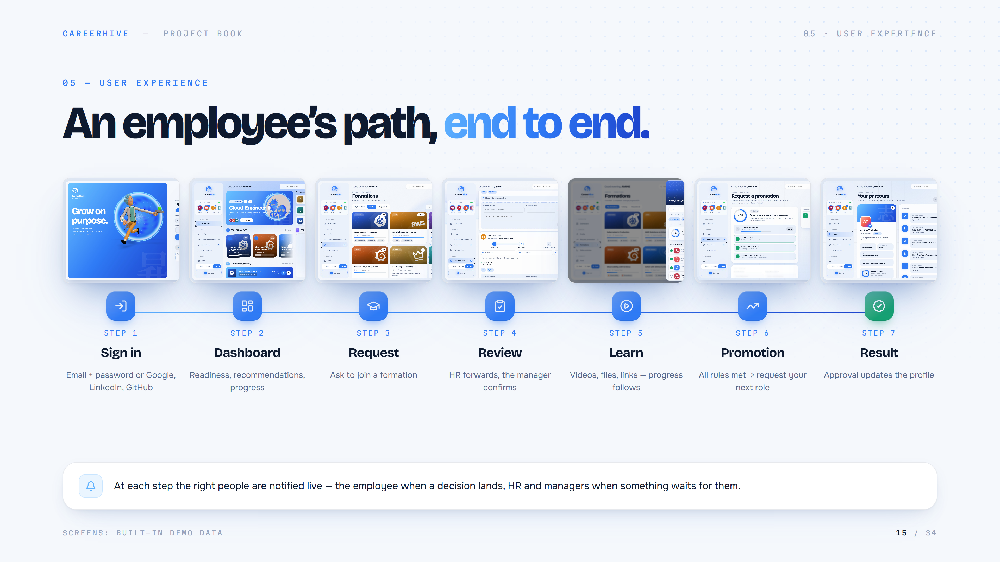</p>

Sign in → see what unlocks the next role → ask to join a formation → HR forwards, the manager confirms → learn → request
the promotion → the approval updates the profile. At each step the right people are notified live.

## Authentication & security

<p align="center">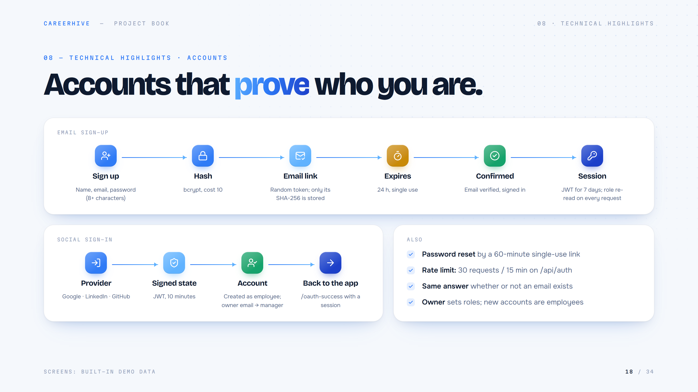</p>

- Passwords hashed with bcrypt (cost 10) and never returned by the API; sessions are JWTs (7 days).
- Email confirmation and reset links use random tokens stored only as SHA-256, single use, valid 24 h / 60 min.
- OAuth uses a signed 10-minute state; new accounts always start as employees, and only the owner changes roles.
- Sign-in and sign-up are rate-limited (30 requests per 15 minutes per client); SQL goes through parameterised queries.
- Uploads get random names; HTML, SVG and scripts are refused, image signatures are checked, CVs are read in memory and never saved.
- Salaries and promotion files are visible only to staff and the employee concerned. Secrets live in a git-ignored `.env`.

## Data model

<details>
<summary><b>23 tables around one: <code>users</code></b></summary>

<br>
<p align="center">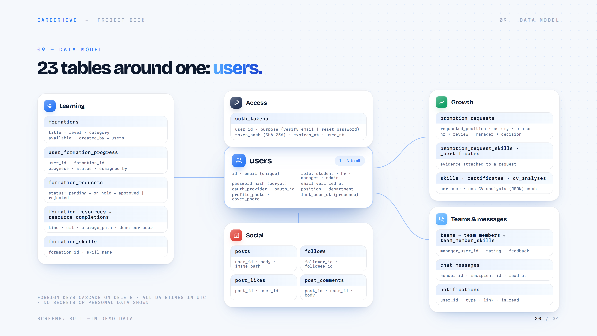</p>

Learning (formations, progress, requests, course content), growth (promotion requests with their evidence, skills,
certificates, CV analyses), teams and messages, the social feed, and single-use auth tokens. Foreign keys cascade on
delete; every `DATETIME` is stored in UTC. The schema is plain, idempotent SQL: `careerhive-backend/sql/schema.sql`.

</details>

## Product film

<p align="center">
  <a href="presentation/video/CareerHive-Film-1080p.mp4">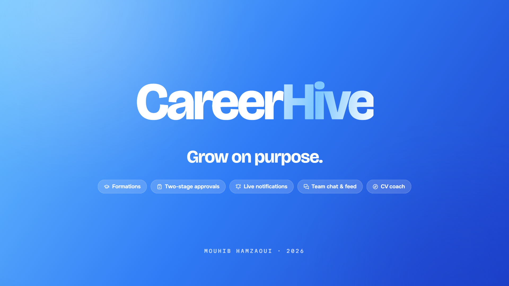</a>
</p>
<p align="center"><a href="presentation/video/CareerHive-Film-1080p.mp4"><b>▶ Watch the CareerHive film</b></a> · 50 s · 1920×1080 · MP4 (29 MB)<br><sub>GitHub doesn't play repository videos inside a README: the link opens the file, which you can download or view raw.</sub></p>

## Project book

<p align="center"><a href="presentation/pdf/CareerHive-Project-Book.pdf">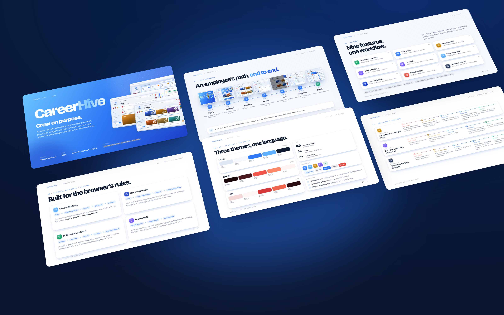</a></p>

A 34-page, 16:9 case study: the problem, the features, architecture, stack, data model, design system, challenges,
security and quality, with real screens and measured numbers.
**[Open the project book (PDF)](presentation/pdf/CareerHive-Project-Book.pdf)** · page previews in [`presentation/pages/`](presentation/pages/)

## Gallery

<table>
  <tr>
    <td width="50%">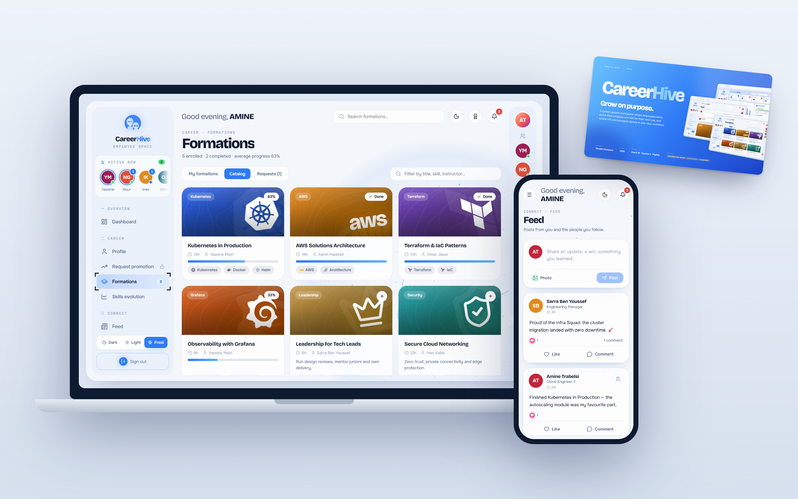</td>
    <td width="50%">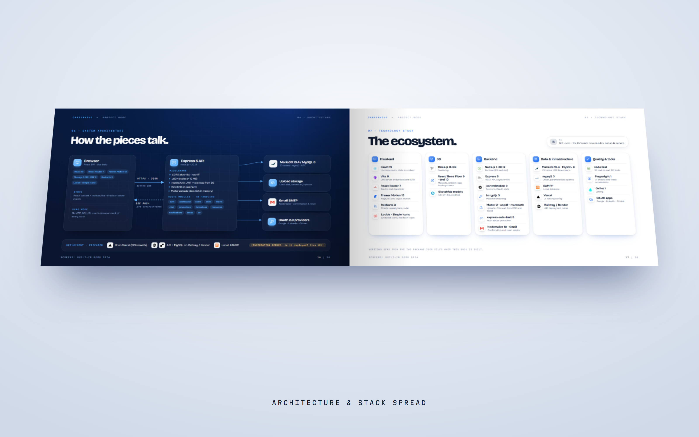</td>
  </tr>
</table>

## Getting started

**Requirements:** Node.js 20.12 or newer, and MariaDB 10.4+ or MySQL 8 (on Windows, XAMPP works out of the box).

```bash
# 1 · the API (careerhive-backend)
cd careerhive-backend
npm install
cp .env.example .env        # set JWT_SECRET and STAFF_EMAILS (your email) at least
npm run db:setup            # creates the "careerhive" database and its tables (empty)
npm run dev                 # http://localhost:8000

# 2 · the UI (careerhive-ui), in a second terminal
cd careerhive-ui
npm install
# create .env.local containing:  VITE_API_URL=http://localhost:8000
npm run dev                 # http://localhost:5173
```

Sign up: the database starts empty, so the first account is yours, and the emails listed in `STAFF_EMAILS` become the
workspace owner. Until SMTP is set, confirmation emails are printed in the API's terminal.

- **Demo data:** `npm run db:demo` loads people, formations, teams and requests into an empty database (password `demo1234`).
- **Without a backend:** leave `VITE_API_URL` empty and the UI runs on its in-browser demo server.
- **Windows:** double-click [`start-careerhive.bat`](start-careerhive.bat): it checks MySQL, starts the API and the UI in their own windows and opens the app.

<details>
<summary><b>Environment variables</b> (names only; see <code>.env.example</code> in each app)</summary>

<br>

| App | Variables |
|---|---|
| API · server | `PORT`, `NODE_ENV`, `API_URL`, `FRONTEND_URL`, `CORS_ORIGINS`, `APP_TIMEZONE` |
| API · auth | `JWT_SECRET` (required in production), `JWT_EXPIRES_IN`, `SIGNUP_ROLES`, `STAFF_EMAILS`, `AUTH_RATE_LIMIT` |
| API · email | `REQUIRE_EMAIL_VERIFICATION`, `SMTP_HOST`, `SMTP_PORT`, `SMTP_USER`, `SMTP_PASS`, `MAIL_FROM` |
| API · database | `DB_HOST`, `DB_PORT`, `DB_USER`, `DB_PASSWORD`, `DB_NAME`, `DB_SSL` |
| API · uploads | `UPLOAD_DIR`, `MAX_UPLOAD_MB` |
| API · social sign-in | `GOOGLE_CLIENT_ID`, `GOOGLE_CLIENT_SECRET`, `LINKEDIN_CLIENT_ID`, `LINKEDIN_CLIENT_SECRET`, `GITHUB_CLIENT_ID`, `GITHUB_CLIENT_SECRET` |
| UI | `VITE_API_URL` (empty = demo mode) |

</details>

## Project structure

```text
careerhive-frontend/
├── careerhive-ui/              React 19 + Vite single-page app
│   └── src/
│       ├── pages/              13 screens: Dashboard, Formations, Profile, Promotion, Reviews, Feed…
│       ├── components/         shell, CV coach, chat, social, notifications, cursor, logo…
│       ├── three/              react-three-fiber scenes: mascots, emblem logo, CV compass
│       ├── store/              React context + reducer, live refresh on server events
│       ├── api/                REST client and the in-browser demo server
│       └── data/               tech-icon registry and demo media
├── careerhive-backend/         Express 5 API
│   ├── src/routes/             12 route modules: auth, formations, promotions, cv, social, chat…
│   ├── src/cv/                 CV text extraction and rule-based analysis
│   ├── sql/                    schema.sql (23 tables) and the demo seed
│   ├── scripts/                database setup / reset / demo, user roles
│   └── test/                   35 end-to-end API tests (node:test)
├── presentation/               project book, diagrams, social kit, mockups, film, and their generator
└── start-careerhive.bat        Windows launcher
```

## API

A REST API under `/api`: every route except `/api/auth/*` and `/api/health` needs `Authorization: Bearer <token>`, and
errors come back as `{ "message": "…" }`. Route groups: auth (sign-up, confirmation, reset, OAuth), dashboard, users and
people, skills and certificates, teams, chat, promotion requests, formations and their requests and content, the CV
coach, notifications (with a live stream) and the social feed. The full table, with who may call what, is in the
**[backend README](careerhive-backend/README.md#api)**.

## Testing

```bash
cd careerhive-backend
npm test        # 35 end-to-end tests against a throw-away careerhive_test database
```

The tests start the real API on a scratch database and cover sign-up, email confirmation and password reset, roles,
the promotion and formation workflows, course content, chat, the live stream, the feed, teams and the CV coach (with a
PDF upload).

## Deployment

**Live at [career-hive-ebon.vercel.app](https://career-hive-ebon.vercel.app)**, on free tiers:

| Part | Host | Setup |
|---|---|---|
| UI | **Vercel** | root `careerhive-ui`; `careerhive-ui/.env.production` sets `VITE_API_URL=https://career-hive.onrender.com`; rebuilt on every push to `main`; `vercel.json` rewrites every path to the SPA |
| API | **Render** | root `careerhive-backend`, build `npm install && npm run db:setup`, start `npm start`, health check `/api/health`; [`render.yaml`](render.yaml) describes the same service as a Blueprint |
| Database | **Aiven**, MySQL 8.4 | `DB_SSL=true` and `DB_SSL_REJECT_UNAUTHORIZED=false` (Aiven signs with its own CA) |

On the API, set `FRONTEND_URL`, `JWT_SECRET`, the `DB_*` variables, `STAFF_EMAILS` and `SMTP_*`; `API_URL` defaults to
Render's own address. Free-tier limits: the API sleeps after 15 idle minutes (the next request waits up to a minute),
uploaded files are lost when it restarts (mount a disk at `UPLOAD_DIR` on a paid plan), and Aiven powers a free
database off after a period of inactivity (power it on again from Aiven's console). Without `VITE_API_URL`, the UI
runs on its in-browser demo server instead.

## Presentation kit

`presentation/` is a complete publication system generated from the real app: a 34-page project book, 15 diagrams,
5 mockups, a social kit (LinkedIn posts and carousel, Instagram, GitHub, portfolio), video overlays and the 50-second
product film with its own synthesised soundtrack. Everything shares the app's fonts, colours and components.

```bash
# from the repository root
node presentation/source/build.mjs all     # book, diagrams, social kit, mockups, overlays
node presentation/source/film.mjs          # the film (needs ffmpeg with libx264)
```

**Updating the screenshots** after UI changes: start the UI in demo mode on port 5199 (no `VITE_API_URL`, so only
fictional demo data appears), run `node presentation/source/capture.mjs http://localhost:5199`, then rebuild. Details
in [`presentation/README.md`](presentation/README.md).

## Author

**Mouhib Hamzaoui** · [GitHub @HMMOUHIB](https://github.com/HMMOUHIB) · [hamzaouimoh54@gmail.com](mailto:hamzaouimoh54@gmail.com)

Designed and built CareerHive end to end: product, interface, backend, database, tests and the presentation system.

## Credits

3D models “rick” by Rached.Abdelkhalek and “Rick and Morty” by Ian Dowson on Sketchfab, CC-BY-4.0 (the licence covers
the models, not the characters). Icons: Lucide (ISC) and Simple Icons (CC0). All screens use the app's built-in demo data.
